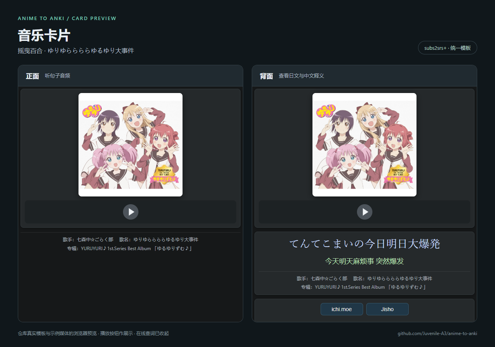
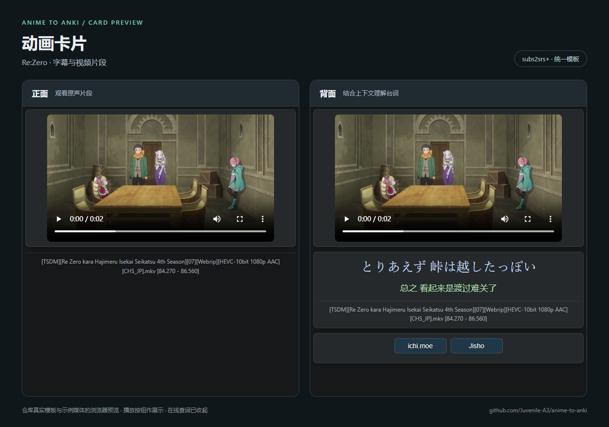

# Anime to Anki · 动画与歌曲制卡工具

用 mpv 看动画时按一次 `a`，把当前日语字幕、中文翻译和视频片段做成 Anki 卡片；也可以用本地歌曲和双语 SRT 批量生成音频卡。两条流程共用 `subs2srs+` 模板。

主要在 Windows 上使用。Python 代码使用标准库；需要自行安装 mpv、FFmpeg，以及用于直接制卡的 AnkiConnect。macOS、Linux 和手机端的实际播放效果尚未在本次发布中验证。

## 先试试示例

下载后，在 Anki 中选择“文件 → 导入”：

| 示例 | 卡片数 | 下载 |
| --- | ---: | --- |
| 摇曳百合主题曲《ゆりゆららららゆるゆり大事件》 | 51 | [cards.apkg](examples/yuruyuri/cards.apkg) |
| Re:Zero 字幕与视频片段 | 8 | [cards.apkg](examples/rezero/cards.apkg) |

示例包包含模板和媒体，导入到独立的 `Anime to Anki Examples` 牌组，使用独立笔记类型，不携带原用户的复习进度。也提供 [TSV、JSON 与媒体文件](examples/README.md)。

## 卡片效果

左侧为正面，右侧为背面。下图使用仓库实际模板和示例媒体在浏览器中渲染；播放按钮用于展示，在线查词面板已收起。Anki 各客户端的播放控件外观可能略有不同。

**音乐卡片：封面与句子音频 → 日文歌词、中文译文和歌曲信息**



**动画卡片：原声视频片段 → 日文台词、中文译文和片段来源**



## 功能

- **mpv 一键制卡**：读取当前字幕和时间点，调用 FFmpeg 截取 WebM 视频；支持双字幕轨、双语字幕和 ASS 字幕。
- **音乐批量制卡**：读取歌曲与日文/中文 SRT，按句切出 MP3，提取封面及歌手、歌名、专辑，输出 Anki TSV。
- **统一模板**：正面听音频或看视频，背面显示日文、注音与中文；支持词义、来源和在线查词。
- **可靠导出**：AnkiConnect 失败时保留本地素材；音乐切片会完整解码检查，并生成媒体校验和及需复核列表。
- **可选 mpv 辅助脚本**：同时间戳双语 LRC 合并显示、字幕自动选择、5 秒跳转、带字幕截图并复制到剪贴板。

## 安装

准备 Python 3.11+、mpv、FFmpeg（`ffmpeg` 和 `ffprobe` 均需在 PATH 中）。直接制卡还需要安装 AnkiConnect 并打开 Anki。

```powershell
git clone https://github.com/Juvenile-A3/anime-to-anki.git
cd anime-to-anki
python -m pip install -e .
```

本仓库采用源码目录安装，模板保存在 `model/subs2srs-plus`。请保留克隆目录。依赖安装入口见 [安装说明](docs/setup.md)。

## mpv → Anki

1. 在 Anki 中新建牌组 `Japanese::Anime`，安装模板：

   ```powershell
   anime-to-anki install-model --config examples/config.toml
   ```

2. 复制 `examples/config.toml` 到 `%APPDATA%\anime-to-anki\config.toml`（不存在时先创建目录）。这个示例已配置 `subs2srs+` 的字段映射。将 `[anki]` 中的 `enabled` 改为 `true`，牌组名称按需调整。
3. 把 `mpv/anime-to-anki.lua` 复制到 `%APPDATA%\mpv\scripts\`。使用 mpv 便携配置时，复制到其 `portable_config/scripts/`。
4. 运行 `anime-to-anki doctor` 检查配置，然后用 mpv 播放带日中字幕的视频，在目标句子按 **`a`**。

默认生成 360p WebM / VP9 + Opus 片段。字幕前后各保留 0.25 / 0.35 秒，通常限制为 1.2–12 秒。快捷键、字幕语言顺序和视频参数均可调整，见 [配置与快捷键](docs/setup.md)。

若不启用 AnkiConnect，输出保存在 `~/AnimeAnki`：四列 `anki_import.tsv`、视频片段和诊断用 `capture_manifest.jsonl`。手动导入前需将媒体复制到 Anki 的 `collection.media`；TSV 与媒体放在同一目录并不代表 Anki 会自动复制媒体。四列导入使用单独的四字段笔记类型，详见安装说明。

`init-config` 仍生成最简 `Basic` 配置，适合已有工作流；使用本仓库统一模板时请从 `examples/config.toml` 开始。

## 歌曲 → Anki

准备本地音频和 UTF-8 的日文 SRT；中文 SRT 可选。歌词的时间轴应与该版本音频相匹配。

```powershell
python tools/music/music_to_anki.py --audio "song.mp3" --japanese "ja.srt" --chinese "zh.srt" --output "exports/song" --deck "Japanese::Music"
```

输出目录包含 `music_import.tsv`、`media/`、`checksums.json`、验证报告和需复核的翻译/长切片列表。打开 Anki，先安装统一模板，然后：

```powershell
python exports/song/install_media.py
python exports/song/install_media.py --install
```

第一条命令只检查，第二条复制媒体。最后在 Anki 中导入 `music_import.tsv`。脚本不会自动导入笔记或修改复习进度；遇到 Anki 中同名但内容不同的媒体会停止。批量清单格式见 [音乐制卡说明](docs/music.md)。

## 模板与辅助工具

- [模板字段及行为](docs/template.md)
- [mpv 脚本与快捷键](docs/setup.md#可选-mpv-脚本)
- [导出自己的示例](examples/README.md#导出自己的示例)

历史模板、个人处理日志、模型缓存、完整音视频和本机配置均未收录。第三方素材与模板来源见 [NOTICE.md](NOTICE.md)；本仓库目前没有统一的开源许可证。

## 开发与验证

```powershell
python -m unittest discover -s tests -v
```

GitHub Actions 对 Python 3.11 / 3.14、Windows / Linux 运行单元测试。单元测试不代表所有 Anki 客户端的音视频播放兼容性均已验证。
